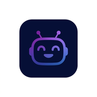

# GenSpark — a Genspark clone that works **online and offline**

A [Genspark](https://genspark.ai)-style AI agent search app rebuilt from scratch with **zero runtime dependencies** (vanilla HTML/CSS/JS). It looks like Genspark, generates Genspark-style *Sparkpages*, ships an always-available **SparkAI copilot**, and — unlike most AI apps — keeps working with **no internet connection at all**.



## Run it

Any static file server works:

```bash
python3 -m http.server 8080 --bind 0.0.0.0
# open http://localhost:8080
```

## How it works online 🌐

- Enter any search → the agent fetches live data from the **Wikipedia API** (no API key needed — it uses CORS-enabled endpoints) and synthesizes a Sparkpage: title, sources, hero image, key facts, structured sections, image gallery, related searches.
- Everything the agent reads is cached by the service worker, so pages you visited once stay available offline.

## How it works offline 📦

The app itself is a **PWA**: after the first visit, the service worker precaches the whole app shell (`sw.js`), and the install button puts it on your home screen. With no connection you still get:

- **Search** over a built-in knowledge base of 30+ curated topics (AI, quantum computing, climate change, Mars, black holes, EVs, CRISPR, Einstein…), with fuzzy matching and graceful "no entry yet" pages for unknown queries.
- **SparkAI copilot** — a fully local assistant that answers questions about the open page, summarizes it, lists facts, does math, tells the time, and searches topics: `summarize this page`, `key facts`, `12 * (3 + 4)`, `search black holes`.
- **Autopilot agent** — decomposes a research task into steps and executes them locally to produce a final Sparkpage.
- **Personas** — switch the copilot's brain (`@coder`, `@chef`, `@coach`, `@travel`, `@researcher`).
- **Library** — search history + pages you explicitly `⬇ Save offline` (stored on-device, readable forever).

The connection badge (top-right) and a banner make the current mode obvious at all times.

## Architecture

```
index.html              App shell (loads everything, no build step)
assets/css/styles.css   Genspark-inspired dark UI
assets/js/kb.js         Offline knowledge base (36 topics, facts, sections, relations)
assets/js/engine.js     Wikipedia live search · fuzzy local search · copilot brain · autopilot planner
assets/js/app.js        Views, hash router, copilot UI, library, PWA install, connectivity handling
sw.js                   Service worker: precached shell + network-first API caching + offline nav fallback
manifest.webmanifest    Installable PWA metadata
```

### Offline guarantees

- No CDN, no frameworks, no webfonts — nothing external to break.
- Saved pages and history live in `localStorage`.
- Wiki responses are cached at runtime, so previously-searched topics keep rendering offline.

## Tests

```bash
npm install       # jsdom (dev-only)
npm test          # 39 checks: engine unit tests + jsdom DOM integration tests
```

## Notes

This is a demo/educational clone of Genspark's interface and Sparkpage format. Not affiliated with Genspark. Verify important information with primary sources.
